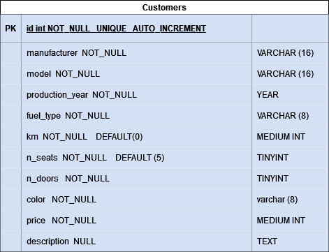

# db-first

Modellizzare la struttura di una tabella per memorizzare tutti i dati riguardanti delle auto usate messe in vendita da un concessionario

PK ID - AUTO_INCREMENT
manufacturer
model
productin_year
fuel_type
km
n_of_seats
n_of_doors
color
price